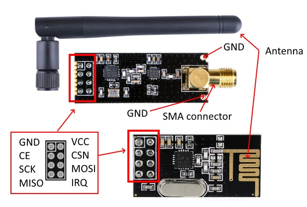
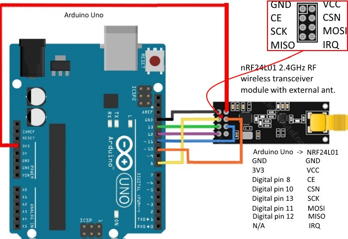
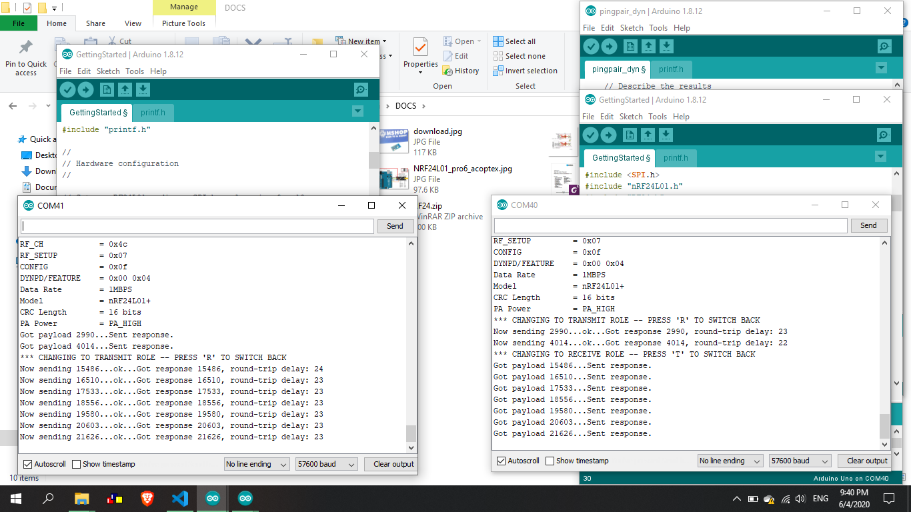

# NRF24L01_Arduino_RaspberryPi

## NRF24L01



## Arduino

Thư viện: `DOCS/RF24.zip`

Thêm thư viện vào arduino: `Sketch >> Include Library >> Add .Zip Library... >> chọn thư viện RF24.zip`

### Kết nối dây và test module RF



- Nạp firmware `Arduino/TX_GettingStarted` vào board phát.
- Nạp firmware `Arduino/RX_GettingStarted` vào board thu.



Bật Serial Monitor trên 2 board Arduino. Nếu kết quả trên 2 monitor nhận được như hình trên thì OK. Nếu không, hãy kiểm tra lại kết nối dây giữa arduino và module RF (trên cả board thu và board phát).

## Raspberry Pi

### Kết nối Wifi và bật SSH không cần màn hình

1. Ghi image vào trong thẻ nhớ

2. Vào trong thư mục boot của thẻ nhớ, tạo file `ssh` với nội dung là 01 dấu cách(space).

3. Kết nối wifi

tạo file `wpa_supplicant.conf` trong thư mục boot và nhập nội dung:

```bash
country=VN
ctrl_interface=DIR=/var/run/wpa_supplicant GROUP=netdev
update_config=1

network={
    ssid="NETWORK-NAME"
    psk="NETWORK-PASSWORD"
}
```

reference: https://desertbot.io/blog/headless-raspberry-pi-3-bplus-ssh-wifi-setup

### Cài nodejs

Step 1: Detect What Version of Node.js You Need

`uname -m`

Step 2: Download Node.JS Linux Binaries for ARM

`wget https://nodejs.org/dist/v8.9.0/node-v8.9.0-linux-armv7l.tar.gz`

Step 3: Extract the Archive

`tar -xzf node-v8.9.0-linux-armv7l.tar.gz`

Step 4: Copy Node to /usr/local

`cd node-v8.9.0-linux-armv7l`

`sudo cp -R * /usr/local/`

Step 5: Check If Everything Is Installed Ok

 `node -v`

 `npm -v`

reference: https://www.instructables.com/id/Install-Nodejs-and-Npm-on-Raspberry-Pi/